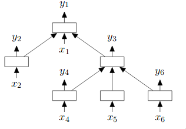

# Structure Based Hate Speech Detection

Contributors: Ravsimar Singh, Ishita Vohra, Aniket Shrimal, Harsh Shukla

## Usage
All source code is in the `src` folder. Most of our code is in the form of jupyter notebooks

hate-speech-model2.ipynb => Combining basic features and using Logistic Regression with regularisation. It also contains the baseline code.

structure-based-hate-speech.ipynb => Incorporating features such as dependency trees using TreeLSTM model. It also contains the final code.

## Problem Statement 
Traditional methods for hate speech detection use tons of training data to mine the hateful structure but due to disproportionate use of different terms they are prone towards learning bias against specific objects, personalities or groups. Idea is to propose a method that takes into account the grammatical structure of the sentence to predict hatefulness.

## Data
We are using already available data on Twitter for hate speech recognition consisting of around 25,000 tweets. Each tweet is classified into 3 categories - Hate speech, Offensive, or neither. We use this information to build a classifier for new tweets.

| Class | No of Tweets  |
| ------- | --- |
| Hate Speech | 1431 |
| Offensive | 19190 |
| Neither | 4163 |

## Preprocessing
We have used the following techniques for preprocessing:
- Stopword Removal - A stop word is a commonly used word (such as “the”, “a”, “an”, “in”). These are usually removed as a part of preprocessing since they do not convey any meaning, but instead, are used to provide fluidity to the sentence.
- Removing excess letters, other twitter specific data (URLs, @mentions, hashtags) - Particularly in social media, these types of words are unique and must be removed, since they do not contribute much to actual meaning being conveyed in the sentence.

## Feature Extraction
*Vectorization* - We call vectorization the general process of turning a collection of text documents into numerical feature vectors. This specific strategy (tokenization, counting and normalization) is called the Bag of Words or “Bag of n-grams” representation. Documents are described by word occurrences while completely ignoring the relative position information of the words in the document. Scikit-learn provides utilities for the most common ways to extract numerical features from text content, namely:
  * tokenizing strings and giving an integer id for each possible token, for instance by using white-spaces and punctuation as token separators.
  * counting the occurrences of tokens in each document.
  * normalizing and weighting with diminishing importance tokens that occur in the majority of samples/documents.
We used the following features:
* CountVectorizer - It counts the number of times a token shows up in the document and uses this value as its weight. The combination of n grams which we used are as follows: 
 * Unigrams
 * Unigrams and Bigrams
 * Unigrams, Bigrams and Trigrams
* TfIdfVectorizer - TF-IDF stands for "term frequency-inverse document frequency", meaning the weight assigned to each token not only depends on its frequency in a document but also how recurrent that term is in the entire corpora.It converts the text documents to a matrix of tfidf features. The combinations of n grams which we used are as follows: 
  * Unigrams
  * Unigrams and Bigrams
  * Unigrams, Bigrams and Trigrams
* POS Tagging - It means labelling words with their Part of Speech. It is a supervised learning solution that uses features like previous word, next word, is first letter captialized etc. NLTK library has a function to get POS tags after tokenization. POS tags unigrams, bigrams and trigrams are weighed by their Tf-Idf.
* Sentiment Analysis + Other features - Sentiment Analysis is an automated process that detects subjective opinions from a text categorising it as positive, negative or neutral. We used Python's NLTK library for this which calculates to polarity(sentiment analysis) of every sentence.Polarity means emotions expressed in a sentence.
* Other Features - We also incorporated various other scores like FRE (Flesh Reading Ease) scores and FKGL (Flesh-Kincaid Grade Level scores) which are based on number of words and syllables in a document. They are used to increase the readability of a document.
* Concatenating the features -  We concatenated these features(i.e sentiment analysis, POS tagging, other features and TfIDF Vectorizer) and made a feature set which is a very high dimensional vector and is sparse. This sparse feature set leads to  overfitting. So to avoid this we used Logistic Regression with regularization parameters (L1, L2).

## Models Incorporated
Our baseline models include models such as Logistic Regression, SVMs and LSTMs. But for final phase we used TreeLSTM. We also changed our feature space and performed Logistic Regression with regularisation.
* Logistic Regression (with and without Regularisation): When we use either L1 or L2 regularisation(adding bias) it reduces the overfitting and increase the generalisation perfomance. However too much bias will result in underfitting. Hence we took only L1 and L2 regularisation. 
* Support Vector Machines: 
* LSTM
* TreeLSTM - Our final code implements a more complex model, TreeLSTM, which incorporates non-linear semantic features such as Dependency Trees into our model. Using TreeLSTM, we are able to use the Dependency Parse Trees as features in our model. The difference  between  the  standard LSTM  unit  and  Tree-LSTM  units  is  that  gating vectors  and  memory  cell  updates are dependent on  the  states  of  possibly  many  child  units. Additionally, instead of a single forget gate, the Tree-LSTM unit contains one forget gate f  jk  for each child k.   This  allows  the  Tree-LSTM  unit  to  selectively incorporate information from each child.

### Metrics used
* Accuracy
* F1-Score
* Recall  

## Analysis
- For n-grams we restricted upto trigrams only (i.e n = 3). As the n-gram length increases, the amount of times we will see any given n-gram will decrease. Theoretically higher n gram contains information regarding word’s context but practically it doesn’t generalize well to other datasets as the number of events it has seen during a training becomes progressively less. This leads to overfitting. Hence we prefer lower n.
- Baseline: SVM's didn't perform well as compared to Logistic Regression. It gave very less accuracies (~ nearly 75%). LSTM worked moderately well. The accuracy for LSTM was around 84%. 
- Final Model: On the basis of above metrics we found that TreeLSTM resulted in highest accuracy(91.26%) and highest F1-score(0.90). When we used our new feature space(i.e concatenating all the three features) and used Logistic Regression with L1 regularisation, accuracy was 89.91%, F1-score was 0.90 and recall was the highest(0.79). But we prefer using TreeLSTM since the feature space is sparse, model results in overfitting. We have tried to reduce it by using L1 regularisation, still it may persist in the model as it has not been removed completely.  
### Hence TreeLSTM is preferred over all the models we tried.

| Model | Accuracy  | F1-score | Recall | 
| ------- | ------- | -------- | ---- |
| TreeLSTM | 91.26% | 0.90 | 0.66 | 
| Basic Feature Space and LR with L1 regularisation | 89.91 | 0.90 | 0.79 | 

 

## Youtube link
[Video](https://youtu.be/ZNLLM59qlj4)
